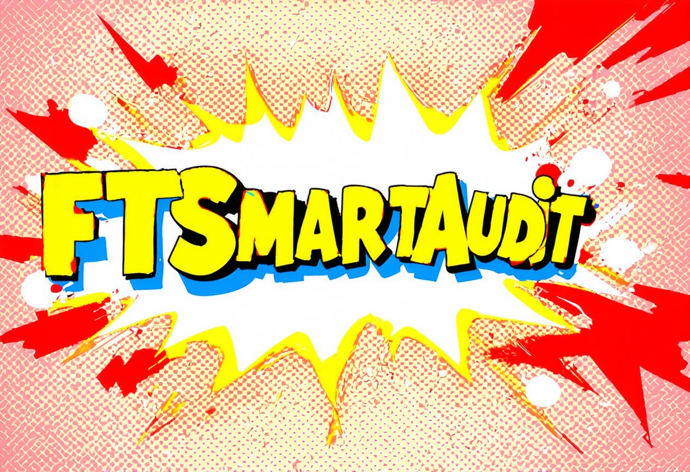

  <a href="https://huggingface.co/weifar"><picture>
    
      </picture></a>

### Specialized Models for Smart Contract Auditing!

## ✨ Run Specialized Models

All notebooks are **beginner friendly**! Add your smart contract dataset, click "Run All", and you'll get a auditing report. Use can use our colab scripts or your local devices.

| Model List | Free Notebooks | Model Source | 
|-----------|---------|--------|
| **FTAudit-Llama3 (8B)**      | [▶️ Start for free](https://colab.research.google.com/drive/1Y_SHymcZGr98832GTSF46J1_JHtHgYhy?usp=sharing)               | [Download](https://huggingface.co/weifar/FTAudit-Llama3-8b-v1.0) | 
| **FTAudit-Mistral (7B)**    | [▶️ Start for free](https://colab.research.google.com/drive/11MYFl14fvdVtEHqKxFXDSMY_L80PzWA7?usp=sharing)               | [Download](https://huggingface.co/weifar/FTAudit-Mistral-7b-v1.1) | 
| **FTAudit-Gemma (7B)**      | [▶️ Start for free](https://colab.research.google.com/drive/18qzvkx__LwX6DPik3U5HBb61kwvaxWHO?usp=sharing)               |[Download](https://huggingface.co/weifar/FTAudit-Gemma-7b-v1.0) | 
| **FTAudit-Codegemma (7B)**      | [▶️ Start for free](https://colab.research.google.com/drive/18qzvkx__LwX6DPik3U5HBb61kwvaxWHO?usp=sharing)               |[Download](https://huggingface.co/weifar/FTAudit-CodeGemma-7b-v0.4) | 

## 🦙 FTAudit.ai News
- 🍀 NEW! [Gemma-2-9b](https://colab.research.google.com/drive/1vIrqH5uYDQwsJ4-OO3DErvuv4pBgVwk4?usp=sharing) and Gemma-2-27b now supported
- 🐥 UPDATE! [FT-Audit-Codegemma](https://colab.research.google.com/drive/18qzvkx__LwX6DPik3U5HBb61kwvaxWHO?usp=sharing) model updated

## 🔗 Links and Resources
| Type                            | Links                               |
| ------------------------------- | --------------------------------------- |
| 📚 **Documentation & Wiki**              | [Read Our Wiki](https://github.com/LLMSmartAudit/FTSmartAudit/wiki) |
| 🥇 **Benchmarking**                   | [Details](https://github.com/LLMSmartAudit/FTSmartAudit/tree/main/Benchmark)|
| 🌐 **Evaluation**            | [Reports](https://github.com/LLMSmartAudit/FTSmartAudit/tree/main/EvaluationReports)|

### Thank You to
- [Unsloth AI](https://unsloth.ai) for providing [Faster Interface Plan](https://github.com/unslothai/unsloth), accelerate our evaluation.

