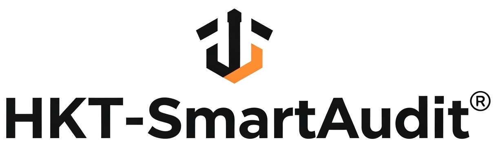
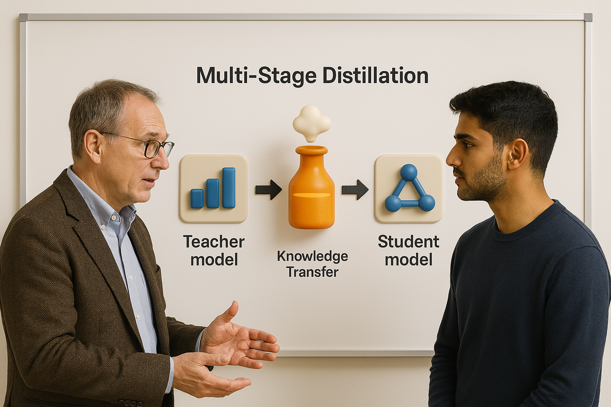
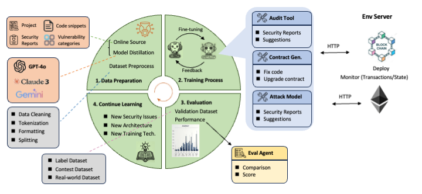
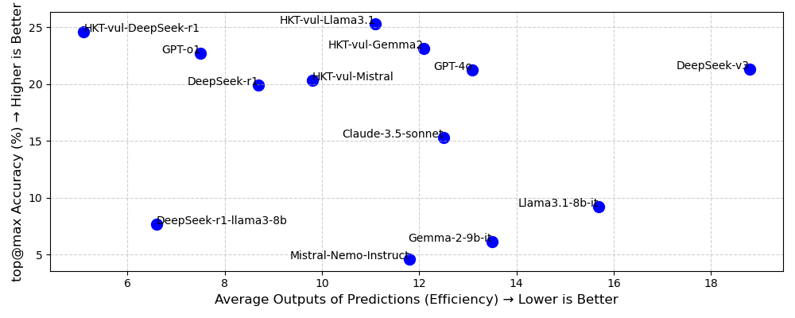
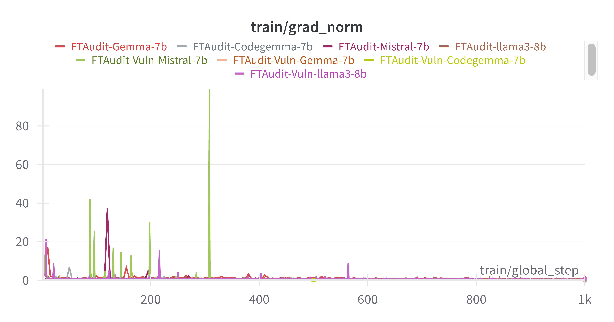
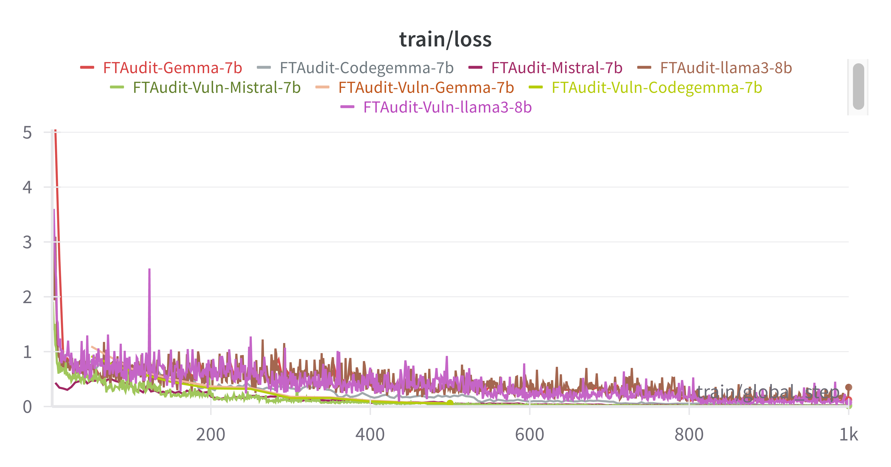
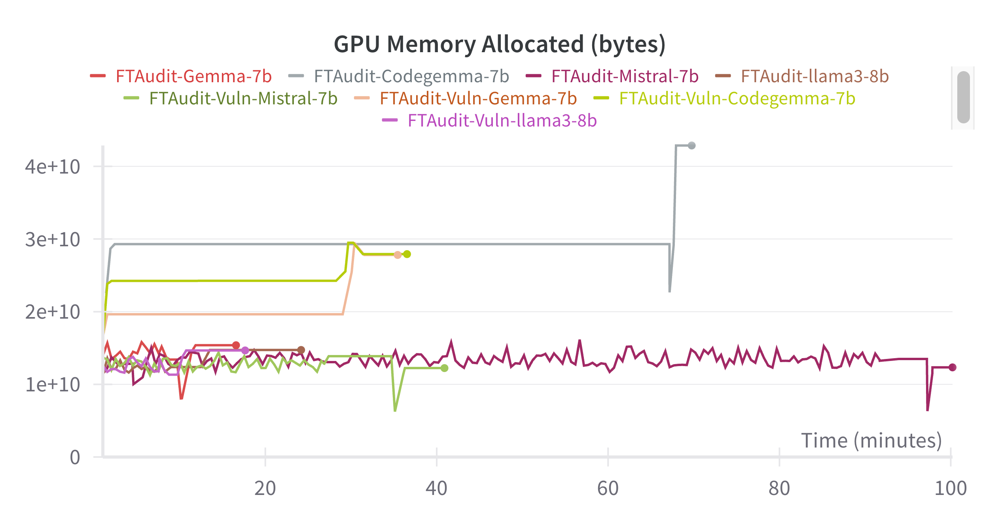
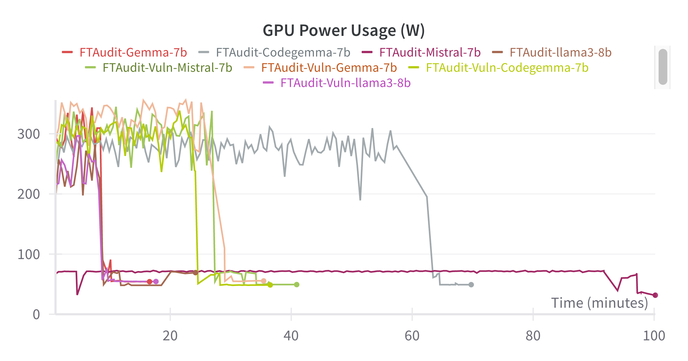

<div align="center">

  <a href="https://huggingface.co/weifar"><picture>
    
      </picture></a>


# Distilling Lightweight Specialized Models for Smart Contract Auditing!


</div>

## 🎯 Core Idea: Teacher-Student Distillation

<div align="center">
  
</div>

## 🕌 HKT-SmartAudit Ecosystem 
<div align="center">
  
</div>

Our ecosystem provides a comprehensive solution for smart contract auditing with:

- 🛠️ A suite of specialized models for different audit needs
- 💻 User-friendly interfaces for seamless interaction
- ⚡ Powerful backend infrastructure for efficient processing

By leveraging these specialized models, our Ecosystem helps users quickly and accurately identify potential vulnerabilities in their smart contracts, providing valuable insights and recommendations for improvement.

## 🚀 Run Specialized Models

All notebooks are **beginner-friendly**! Simply add your smart contract dataset, click "Run All", and receive a detailed audit report. Available for both Colab and local execution.

### 🌟 Featured Models

| Model List | Base Model | Notebooks | Model Source | 
|-----------|---------|---------|--------|
|**HKT-DeepSeek-R1 (8b)**|DeepSeek-R1-Distill-Llama-8B|-| [🤗 Download](https://huggingface.co/weifar/HKT-vul-DeepSeek-R1-8b-it-v0.2)|
|**HKT-Llama-3.1 (8b)**| Meta-Llama-3.1-8B-Instruct-bnb-4bit|-| [🤗Download](https://huggingface.co/weifar/HKT-vul-llama3_1-8b-it-v0.2) |
|**HKT-Gemma-2 (9b)** | gemma-2-9b-bnb-4bit|-|[🤗 Download](https://huggingface.co/weifar/HKT-vul-Gemma-2-9b-it-v0.2)|
|**HKT-Mistral-Nemo (12b)**| Mistral-Nemo-Instruct-2407-bnb-4bit |-|[🤗 Download](https://huggingface.co/weifar/HKT-vul-Mistral-Nemo-it-v0.2)|
|**HKT-Qwen-2.5-coder (7b)**| Qwen/Qwen2.5-Coder-7B-Instruct|-| [🤗 Download](https://huggingface.co/weifar/HKT-vul-qwen2.5-coder-7b-it-v0.1) |
|**HKT-Llama-3.2 (1b)**| Llama-3.2-1B-Instruct-bnb-4bit|-| [🤗 Download](https://huggingface.co/weifar/HKT-vul-llama-3_2-1b-it-v0.1) |
| **FTAudit-Llama3 (8B)**      | Meta-Llama-3-8B-Instruct-bnb-4bit | [▶️ Colab](https://colab.research.google.com/drive/1Y_SHymcZGr98832GTSF46J1_JHtHgYhy?usp=sharing)               | [🤗 Download](https://huggingface.co/weifar/FTAudit-Llama3-8b-v1.0) | 
| **FTAudit-Mistral (7B)**    | mistral-7b-instruct-v0.3-bnb-4bit |[▶️ Colab](https://colab.research.google.com/drive/11MYFl14fvdVtEHqKxFXDSMY_L80PzWA7?usp=sharing)               | [🤗 Download](https://huggingface.co/weifar/FTAudit-Mistral-7b-v1.1) | 
| **FTAudit-Gemma (7B)**      | gemma-1.1-7b-it-bnb-4bit |[▶️ Colab](https://colab.research.google.com/drive/18qzvkx__LwX6DPik3U5HBb61kwvaxWHO?usp=sharing)               |[🤗 Download](https://huggingface.co/weifar/FTAudit-Gemma-7b-v1.0) | 

### 🔍 Earlier Research Models

| Model List | Model Source |  
|-----------|---------|
| FTAudit-Codellama-v0.2 (13B) | [⬇Download](https://huggingface.co/weifar/FTAudit-Codellama-13b) |
|FTAudit-Codellama (7B)|[⬇Download](https://huggingface.co/weifar/FTAudit-Codellama-7b)|
|FTAudit-Llama2 (7B)|[⬇Download](https://huggingface.co/weifar/FTAudit-Llama3-7b)|

## 🦙 FTAudit.ai News
- 🆕 **New Release!** Adapting our method to smaller models: [HKT-vul-llama-3_2-1b](https://huggingface.co/weifar/HKT-vul-llama-3_2-1b-it-v0.1)
- 🆕 **New Experiment!** Testing with reasoning models: [HKT-vul-DeepSeek-R1-8b](https://huggingface.co/weifar/HKT-vul-DeepSeek-R1-8b-it-v0.2)

## 📊 Experimental Datasets & Results

We rigorously evaluated our models across three distinct datasets. All evaluation metrics, reports, and detailed analyses are available in their respective repositories:

### 1. Standard Vulnerability Set
<div align="center">
  
</div>

- **Dataset**: SmartBugs-curated [[1]](#) (143 contracts, 182 DASP-classified vulnerabilities)
- **Scope**: 10 common vulnerability types
- **Evaluation Results**: [`evaluation`](https://github.com/LLMSmartAudit/FTSmartAudit/tree/main/EvaluationReports/DetectableReports)  
  → Precision/Recall metrics, confusion matrices, per-vulnerability breakdown

### 2. Real-World Projects Set
<div align="center">
  
</div>

- **Dataset**: Code4rena-audited [[13]](#) (6,454 contracts from 72 projects)
- **Key Stats**: 243 issue contracts, 784 high/medium severity findings
- **Evaluation Results**: [`evaluation`](https://github.com/LLMSmartAudit/FTSmartAudit/tree/main/EvaluationReports/ContestReports)  
  → False-positive analysis, complexity-scaling tests, gas optimization impact

### 3. CVE Benchmark Set
<div align="center">
  
</div>

- **Coverage**: 13 critical CVEs (Jan 2025 snapshot)
- **Categories**: 
  ```python
  ["Integer Overflow", "Access Control", "Logic Bugs", "Other Critical"]
  
## 🔗 Links and Resources
| Type                            | Links                               |
| ------------------------------- | --------------------------------------- |
| 📚 **Documentation & Wiki**              | [Read Our Wiki](https://github.com/LLMSmartAudit/FTSmartAudit/wiki) |
| 🥇 **Benchmarking**                   | [Details](https://github.com/LLMSmartAudit/FTSmartAudit/tree/main/Benchmark)|
| 🌐 **Evaluation**            | [Reports](https://github.com/LLMSmartAudit/FTSmartAudit/tree/main/EvaluationReports)|


## 🐞 Vulnerability Categories
Smart contract vulnerabilities can be divided into two categories: machine-auditable and machine-unauditable. Machine-auditable vulnerabilities can be identified by conventional tools, whereas machine-unauditable vulnerabilities require human auditors for detection. In our study, we label these machine-auditable vulnerabilities as “detectable vulnerabilities” and the machine-unauditable ones as “undetectable vulnerabilities.” Our fine-tuning dataset incorporates both types, comprising a total of 112 distinct vulnerability labels.

### 🔍 Detectable Vulnerabilities

These vulnerabilities can be identified by conventional automated tools.

<!-- <details> -->
<!-- <summary><strong>Click to expand the table of Detectable Vulnerabilities</strong></summary> -->
<div align="center">

| Vulnerability Type | Description |
|--------------------|-------------|
| Reentrancy | Allows a function to be interrupted and re-entered before completion |
| Predictable Randomness | Use of deterministic values for random number generation |
| Integer Overflow | Arithmetic operations exceeding the max value for the data type |
| Unchecked Low-Level Calls | Failure to check return values of low-level function calls |
| Front-running | Exploitation of transaction ordering in the blockchain |
| Denial-of-Service | Preventing legitimate users from accessing the contract |
| Access Control | Improper restrictions on who can execute certain functions |
| Time Manipulation | Exploitation of block timestamp dependencies |
| Uninitialized Struct | Using struct variables without proper initialization |
| Short Address | Exploiting EVM padding behavior in function parameters |

</div>
<!-- </details> -->

### 🕵️ Undetectable Vulnerabilities

These vulnerabilities require human auditors for detection due to their complexity or context-dependent nature.

<!-- <details> -->
<!-- <summary><strong>Click to expand the full list of Undetectable Vulnerabilities</strong></summary> -->

1. Price Manipulation
2. Lack of Input Validation
3. Hidden Ownership Change
4. Unrestricted Initialization
5. State Manipulation
6. Misuse of `msg.value` within a loop
7. Incorrect Allowance Update Logic
8. Data Corruption
9. Lack of Withdrawal Function
10. Missing Authorization Checks
11. Storage Error
12. Hash Collision
13. Misuse of `shr` without Context
14. Uninitialized Return Variable
15. Constructor Misdeclaration
16. Potential Unintended Behavior
17. Missing `onlyOwner` Modifier
18. Shadowing State Variable
19. Uninitialized State Variable
20. Improper Struct Initialization
21. Improper Initialization Check
22. Withdrawal Functions without Proper Access Control
23. Direct Modification of Array Length
24. Misuse of Assembly `return`
25. Unchecked Transfer
26. Unsafe Enum Conversion
27. Impracticality of Exact Match
28. Lack of Functionality
29. Mapping Deletion
30. Shadow State Variable
31. Misinterpretation of Unsigned Integer Comparison
32. Redundant Condition
33. Integer Division Resulting in Loss of Precision
34. Atomicity and Ordering
35. Constructor Inheritance
36. Constructor Execution Order
37. Unused Return
38. Overshadowing Built-in XX
39. Incorrect Data Type
40. Uninitialized Function Pointer
41. Use of Variable before Declaration
42. Improper Scope of Variable
43. Incorrect Scope of Variable `max`
44. Incorrect Constructor Call
45. Unbounded Loop with External Calls
46. Missing State Variable Declarations
47. Incorrect Increment Operation
48. Incorrect Operation
49. Unbounded Gas for External Calls
50. Incorrect Use of `assert`
51. Unnecessary Comparison
52. Deprecated Features
53. Unpredictable Initialization
54. Redundant Statements and Syntax Errors
55. Incomplete Implementation
56. Inefficient State Modifications in a Loop
57. Misuse of Mapping Getter
58. Cancellation Authority
59. Discrepancy in Balance Calculation
60. Dependence on External Data
61. Complexity
62. Funding Rate Calculation Precision
63. Minting Permissions
64. Flash Loan Fee Manipulation
65. Centralized Risk
66. Single Points of Failure
67. Potential Ownership Hijacking
68. Insecure Ownership Deletion
69. Constructor Syntax
70. Uninitialized `creator` Variable
71. Incorrect Require Condition in `withdraw` Function
72. Uninitialized Constructor
73. Missing Zero-Address Check
74. Lack of Access Control for Sensitive Functions
75. Signature Malleability
76. Incorrect Signature Verification
77. Potential Inconsistency
78. Oracle Manipulation
79. Oracle Downtime
80. Missing Nonce Increment
81. Off-chain Signature
82. Replay Attack
83. Owner's Absolute Control Over Critical Functions
84. Misuse of `msg.sig` for Authorization
85. Unchecked Return Values for ERC20 Transfers
86. Potential for Inaccurate Data
87. No Validation of the Price Source
88. Lack of Proper Error Handling in SafeMath Library
89. Missing SafeMath Functions for Division
90. Unchecked Division by Zero
91. Overflow and Underflow in `transfer` and `transferFrom` Functions
92. Single Point of Failure
93. Deprecated `throw`
94. Hardcoded Timestamp
95. Use of Deprecated Functions
96. Logic errors in state machine implementations
97. Potential Token Lockup
98. Unlimited Token Approval
99. Improper Event Emission
100. Incorrect Handling of ETH Transfers
101. Lack of Pull Payment Implementation
102. Incorrect use of fallback functions

<!-- </details> -->

## Newly Discovered Vulnerabilities:
Our models have successfully identified **13 vulnerabilities** across **4 different types** that were not detected in the audit reports from Code4rena.

<!-- <details> -->
<summary><h4>📜 Full List of Undetected Vulnerabilities</h4></summary>

- **Potential Token Lockup**:

  -- In yVault.sol, the `earn` function transfers the available tokens to the controller without any checks or restrictions. If the controller contract is not properly implemented or has a vulnerability, it could potentially lock up the tokens and make them irretrievable.

```solidity
function earn() external {
    uint256 _bal = available();
    token.safeTransfer(address(controller), _bal);
    controller.earn(address(token), _bal);
}
```

-- The `mint` function of sYETIToken.sol, sends the YETI tokens to the sYETI contract using the `sendToSYETI` function of the `yetiToken` contract. If the `yetiToken` contract has a vulnerability or is not properly implemented, it could potentially lock up the tokens and make them irretrievable.

```solidity
function mint(uint256 amount) public returns (bool) {
    User memory user = users[msg.sender];
    uint256 shares = totalSupply == 0 ? amount : (amount * totalSupply) / effectiveYetiTokenBalance;
    user.balance += shares.to128();
    user.lockedUntil = (block.timestamp + LOCK_TIME).to128();
    users[msg.sender] = user;
    totalSupply += shares;
    yetiToken.sendToSYETI(msg.sender, amount);
    effectiveYetiTokenBalance = effectiveYetiTokenBalance.add(amount);
    emit Transfer(address(0), msg.sender, shares);
    return true;
}
```

- **Insufficient Input Validation**:

  In sYETIToken.sol, the `setTransferRatio` function checks if the new ratio is zero but does not check for overflow. A malicious owner could set a very high transferRatio, potentially manipulating the rebasing mechanism.

```solidity
function mint(uint256 amount) public returns (bool) {
    User memory user = users[msg.sender];
    uint256 shares = totalSupply == 0 ? amount : (amount * totalSupply) / effectiveYetiTokenBalance;
    user.balance += shares.to128();
    user.lockedUntil = (block.timestamp + LOCK_TIME).to128();
    users[msg.sender] = user;
    totalSupply += shares;
    yetiToken.sendToSYETI(msg.sender, amount);
    effectiveYetiTokenBalance = effectiveYetiTokenBalance.add(amount);
    emit Transfer(address(0), msg.sender, shares);
    return true;
}
```

- **Unlimited Token Approval**:

  In the `initialize` function of IdeleYieldSource.sol, the contract approves the `idleToken` to spend an unlimited amount of `underlyingAsset` tokens using `safeApprove` with `type(uint256).max`. This poses a risk if the `idleToken` contract is compromised or has a vulnerability that allows it to drain the approved tokens.
  
```solidity
    function initialize(address _idleToken) public initializer {
        __Ownable_init();
        idleToken = _idleToken;
        underlyingAsset = IIdleToken(idleToken).token();
        IERC20Upgradeable(underlyingAsset).safeApprove(idleToken, type(uint256).max);
        emit IdleYieldSourceInitialized(idleToken);
    }
```

  In the `_sendForReceiver` function of NFTXSimpleFeeDistributor.sol, the contract approves the receiver contract to spend an unlimited amount of tokens using `IERC20Upgradeable(_vault).approve(_receiver.receiver, amountToSend)`. This practice is generally discouraged as it poses a security risk if the receiver contract is compromised or behaves maliciously. 

```solidity
  function _sendForReceiver(FeeReceiver memory _receiver, uint256 _vaultId, address _vault, uint256 amountToSend) internal virtual returns (bool) {
    if (_receiver.isContract) {
      IERC20Upgradeable(_vault).approve(_receiver.receiver, amountToSend);
      
      bytes memory payload = abi.encodeWithSelector(INFTXLPStaking.receiveRewards.selector, _vaultId, amountToSend);
      (bool success, ) = address(_receiver.receiver).call(payload);
      return success && IERC20Upgradeable(_vault).allowance(address(this), _receiver.receiver) == 0;
    } else {
      IERC20Upgradeable(_vault).safeTransfer(_receiver.receiver, amountToSend);
    }
  }
```

  The `_maxApprove` function of SingleTokenJoinV2.sol, grants unlimited token approval to the specified spender if the current allowance is less than the contract's token balance. This could potentially allow the approved spender to transfer more tokens than intended. The contract approves unlimited token spending for each token in the basket using `_maxApprove` before calling `joinPool`. If any of the tokens in the basket are malicious or have a vulnerability, they could potentially drain the approved tokens from the contract.

  The Vault.sol contract does not handle the return values of some external function calls. For example, in the `earn` function, the return value of `_controller.earn` is not checked. If the external function fails or returns an unexpected value, it could lead to inconsistencies or unexpected behavior.

  The `lockWithPermit` function of XDEFIDistribution.sol contract, uses the `permit` function of the `IEIP2612` interface to approve the token transfer. However, there is no check to ensure that the `permit` call was successful before proceeding with the token transfer.


- **Unprotected Function**:
 
Unprotected `setMinter` Function: The `setMinter` function of Position.sol contract, allows the contract owner to set any address as a minter. However, there is no mechanism to prevent the owner from accidentally or maliciously setting an unintended address as a minter.

Unprotected `setParams()` Function: The `setParams()` function of USDV.sol contract, allows the DAO to set the `blockDelay` parameter. However, there are no restrictions on the value that can be set. An attacker controlling the DAO can set an arbitrary `blockDelay`, potentially disrupting the contract's behavior or enabling attacks. It is important to validate and restrict the range of values that can be set for critical parameters.

  Unprotected `setMin` Function: The `setMin` function of Vault.sol, allows the strategist to set the `min` value, which determines the minimum amount of tokens available for earning. However, there is no upper limit or validation on the `_min` value. A malicious strategist could set a very high `min` value, effectively locking up a significant portion of the vault's tokens.

  Unprotected `migrate` function: The `migrate` function of MapleLoan.sol, allows the factory contract to migrate the contract to a new implementation. However, there are no restrictions on the `migrator_` address or the `arguments_` passed to the function. This could lead to unauthorized migration or loss of funds if not properly implemented.

<!-- </details> -->

## 🏋🏿Training Details

<div align="center">
  <table>
    <tr>
      <td></td>
      <td></td>
    </tr>
  </table>
</div>
<div align="center">
  <table>
    <tr>
      <td></td>
      <td></td>
    </tr>
  </table>
</div>


### 😘 Thank You to
- [Unsloth AI](https://unsloth.ai) for providing the Faster Interface Plan, accelerating our evaluations.

## Citation
Feel free to cite us if you like ToolBench.
```bibtex
@misc{wei2024ftaudit,
      title={Leveraging Fine-Tuned Language Models for Efficient and Accurate Smart Contract Auditing}, 
      author={Zhiyuan Wei, Jing Sun, Zijian Zhang, Xianhao Zhang, Meng Li},
      year={2024},
      eprint={2410.13918},
      archivePrefix={arXiv},
      primaryClass={cs.AI}
}
```
